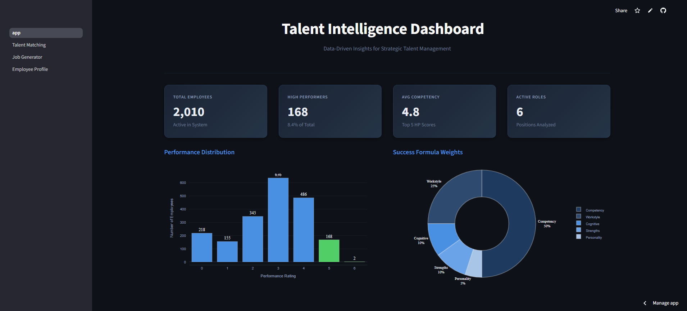
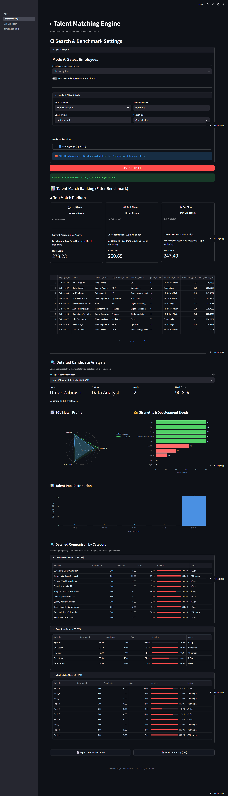
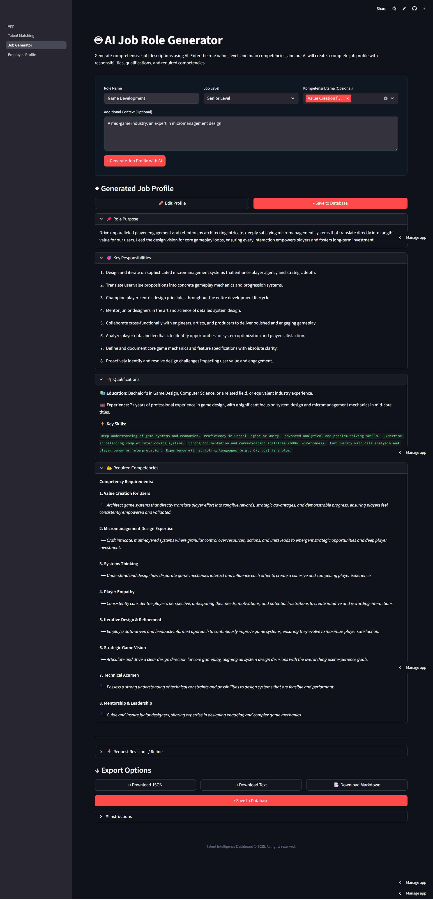

# Talent Intelligence Dashboard

A modern HR analytics dashboard built with Streamlit for talent matching, job profile generation, and employee analytics.



🔗 **Live Demo:** [https://talent-intelligence-dashboard.streamlit.app/](https://talent-intelligence-dashboard.streamlit.app/)

## Case Study Methodology

This project follows a rigorous 3-step data science methodology to transform raw HR data into actionable insights:

### Step 1: Success Pattern Discovery (Analysis)
- **Objective:** Identify the empirical "DNA" of high performers.
- **Process:**
    - Conducted Exploratory Data Analysis (EDA) on 2,010 employees.
    - Analyzed 10 competency pillars, 20 PAPI scales, and 5 cognitive tests.
    - Discovered that **Soft Skills (Competencies)** and **Work Style** are the strongest predictors of success.
    - **Output:** A validated "Success Formula" with weighted scoring (50/25/10/10/5).
- **See:** `docs/report/step1_report.pdf`

### Step 2: SQL Matching Engine (Engineering)
- **Objective:** Operationalize the Success Formula into a scalable backend.
- **Process:**
    - Designed an **18-stage CTE (Common Table Expression)** pipeline in PostgreSQL.
    - Implemented normalization, weighted scoring, and gap analysis logic directly in the database.
    - Ensured sub-second query performance for 10,000+ records.
    - **Output:** A robust SQL engine capable of "Mode A" (Cloning) and "Mode B" (Role-based) matching.
- **See:** `docs/report/step2_report.pdf` & `docs/SQL_ENGINE_TEMPLATE.sql`

### Step 3: AI-Powered Dashboard (Product)
- **Objective:** Deliver insights to end-users via an intuitive interface.
- **Process:**
    - Built a **Streamlit** application to visualize the SQL engine's outputs.
    - Integrated **Google Gemini AI** to generate job profiles that bridge the gap between recruitment and internal matching.
    - Created interactive visualizations for gap analysis (Radar charts, Bar charts).
    - **Output:** The final deployed application.
- **See:** `docs/report/step3_report.pdf`

## Features

### 1. Talent Matching Engine
Match employees to job positions using competency-based algorithms. Supports multiple benchmarking modes:
- Individual employee position recommendations
- Manual benchmark comparisons
- Filter-based talent search
- High performer profiling



### 2. AI Job Generator
Generate professional job descriptions using AI:
- Role purpose & responsibilities
- Required qualifications
- Competency requirements with context
- Export to JSON, text, or markdown
- AI-powered refinement



### 3. Employee Profile Viewer
Comprehensive employee analytics:
- Competency radar charts
- Performance history tracking
- PAPI work style analysis (20 scales)
- Career journey visualization
- Personalized development recommendations

## Tech Stack

- **Frontend:** Streamlit
- **Database:** PostgreSQL
- **AI:** Google Gemini API
- **Charts:** Plotly
- **Backend:** Python 3.x

## Installation

1. Clone the repository
```bash
git clone https://github.com/engkinandatama/talent-intelligence-dashboard.git
cd talent-intelligence-dashboard
```

2. Create virtual environment
```bash
python -m venv venv
source venv/bin/activate  # On Windows: venv\Scripts\activate
```

3. Install dependencies
```bash
pip install -r requirements.txt
```

4. Set up environment variables
Create `.streamlit/secrets.toml`:
```toml
GEMINI_API_KEY = "your-gemini-api-key"

[database]
host = "your-db-host"
port = 5432
database = "your-database-name"
user = "your-username"
password = "your-password"
```

5. Run the application
```bash
streamlit run app.py
```

## Project Structure

```
talent-intelligence-dashboard/
├── app.py                      # Main dashboard with key metrics
├── pages/
│   ├── 1_Talent_Matching.py    # Talent matching engine (3 modes)
│   ├── 2_Job_Generator.py      # AI job generator with Gemini
│   └── 3_Employee_Profile.py   # Employee analytics viewer
├── core/
│   ├── db.py                   # Database connection handler
│   ├── matching.py             # SQL-based matching engine (18-stage CTE)
│   ├── matching_breakdown.py   # Detailed match breakdown analysis
│   ├── job_generator.py        # Job vacancy save/load functions
│   └── analysis_ui.py          # Analysis UI components
├── analysis/                   # Step 1 Analysis Scripts
│   ├── step1_full_analysis.py  # Main visual generator script
│   ├── extract_report_data.py  # Data extraction utility
│   └── report_data.txt         # Generated statistical data
├── scripts/
│   ├── db_tools.py             # Manual DB connection utility
│   └── test_dashboard.py       # Comprehensive test suite
├── docs/
│   ├── report/                 # Final PDF Reports (Step 1, 2, 3)
│   ├── .md/                    # Markdown report sources
│   ├── SQL_ENGINE_TEMPLATE.sql # Core SQL Logic
│   └── MATCHING_ALGORITHM.md   # Algorithm documentation
└── img/                        # Project images & assets
```

## Matching Algorithm

The dashboard uses a **weighted scoring system** with the following Talent Group Variable (TGV) weights:

| TGV | Weight | Description |
|-----|--------|-------------|
| **Competency** | 50% | 10 core competencies from assessment |
| **Work Style** | 25% | 20 PAPI Kostick scales |
| **Cognitive** | 10% | 5 psychometric test scores (IQ, GTQ, TIKI, Pauli, Faxtor) |
| **Strengths** | 10% | Top 5 CliftonStrengths themes |
| **Personality** | 5% | MBTI & DISC profiles |

**Matching Logic:**
- Uses **latest year data only** for temporal consistency
- Benchmark = High Performers (rating 5) in current year
- Data completeness indicator (out of 37 total variables)
- 18-stage CTE pipeline for efficient SQL execution

## Database Schema

**Core Tables:**
- `employees` - Employee master data with demographics
- `dim_positions`, `dim_departments`, `dim_divisions`, `dim_grades`, `dim_directorates` - Organizational dimensions
- `dim_competency_pillars` - Competency definitions (10 pillars)
- `talent_group_weights` - TGV weights configuration

**Assessment Data:**
- `competencies_yearly` - Annual competency scores
- `performance_yearly` - Annual performance ratings
- `profiles_psych` - Psychometric test results (IQ, GTQ, TIKI, Pauli, Faxtor, MBTI, DISC)
- `papi_scores` - PAPI Kostick work style profiles (20 scales)
- `strengths` - CliftonStrengths themes

**Application Data:**
- `vacancies` - AI-generated job postings

See `docs/SQL_ENGINE_TEMPLATE.sql` for detailed matching query.

## Usage

### Talent Matching
1. Select Mode A (specific employees) or Mode B (filtered search)
2. Choose benchmark criteria
3. Click "Run Talent Match"
4. Review ranked results with match scores

### Job Generator
1. Enter role name and level
2. Select key competencies
3. Click "Generate Job Profile with AI"
4. Review and refine as needed
5. Save to database or export

### Employee Profile
1. Select employee from dropdown
2. View comprehensive analytics across multiple tabs
3. Explore competency breakdowns and recommendations

## Testing

Run the comprehensive test suite:
```bash
python scripts/test_dashboard.py
```

This validates:
- Database connectivity
- HP count accuracy (latest year filtering)
- TGV weights consistency
- Data completeness calculation
- Query performance

## Key Features

✅ **Smart Benchmarking** - 3 matching modes (Manual, Filter, Default)  
✅ **Temporal Consistency** - Uses latest year data only  
✅ **Data Quality Transparency** - Shows data completeness per candidate  
✅ **AI-Powered Job Generation** - Google Gemini integration  
✅ **Comprehensive Analytics** - 37 talent variables across 5 TGV groups  

## License

MIT License - see LICENSE file for details

## Contributing

Contributions welcome! Please open an issue or submit a PR.
